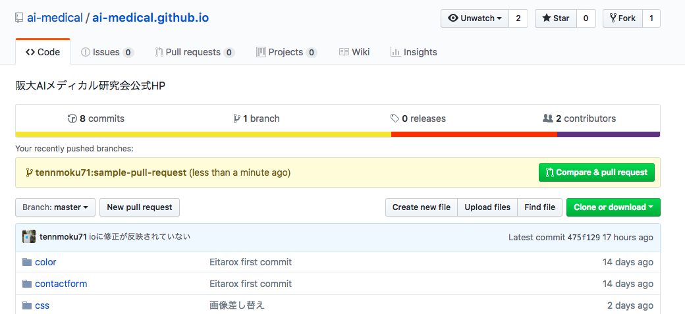
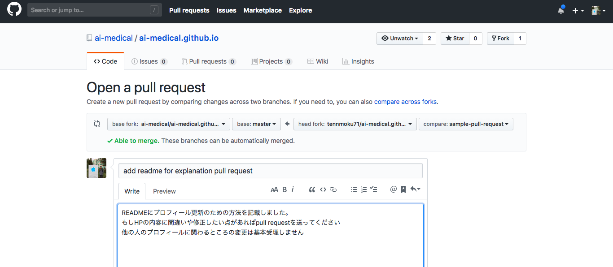

# ai-medical.github.io
阪大AIメディカル研究会公式HP

## リンク　https://ai-medical.github.io

## 内容の更新方法

forkを使ったpull requestで行います。

- forkする
- git clone で自分のレポジトリを取得
- 内容を変更
- pull requestを発行する

の順番です。

https://github.com/ai-medical/ai-medical.github.io
から右上の[fork]ボタンを押し

```
git clone git@github.com:<your account name>/ai-medical.github.io.git
cd ai-medical.github.io
git checkout -b <your name>
<ここで内容を変更する>
git add .
git commit -m "update my profile"
git push origin <your name>
```

以上を行い、pull requestを自分のgithubのリポジトリから発行します

https://github.com/ai-medical/ai-medical.github.io
にアクセスし



AIMSのmasterにmargeを指定してください


